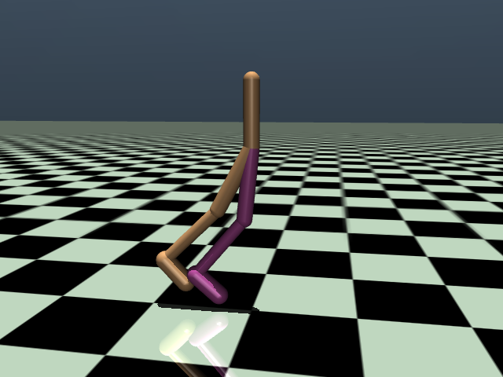

# rl-biped-balance

MuJoCo RL bipedal balance and push recovery.

## Setup

Everything runs in a dedicated conda environment (Python 3.11) so it doesn't
clash with anything else on the machine.

```bash
conda create -n rl-biped python=3.11 -y
conda activate rl-biped
```

If you don't have an NVIDIA GPU (or just want to keep the install small),
grab PyTorch from the CPU-only wheel index first, otherwise pip will pull in
several GB of CUDA packages it won't use:

```bash
pip install torch --index-url https://download.pytorch.org/whl/cpu
```

If you do have an NVIDIA GPU and want CUDA acceleration, skip that step and
just let the next command install the default GPU-enabled PyTorch build.

```bash
pip install mujoco "gymnasium[mujoco]" stable-baselines3 tensorboard imageio opencv-python
```

Note for zsh users: extras like `gymnasium[mujoco]` need to be quoted,
otherwise zsh tries to glob-expand the brackets and fails with
"no matches found".

To come back to this environment later:

```bash
conda activate rl-biped
```

### Verifying the install

```bash
python -c "import mujoco; print(mujoco.__version__)"
python -c "import gymnasium as gym; env = gym.make('Walker2d-v5'); print(env.observation_space, env.action_space)"
python -c "import torch; print(torch.__version__, torch.cuda.is_available())"
```

Confirmed working versions on this machine: MuJoCo 3.13.0, Gymnasium 1.3.0,
Stable-Baselines3 2.9.0, PyTorch 2.14.0+cpu.

## The model

I'm using the simple `walker2d` MJCF model that
ships with Gymnasium's MuJoCo envs
(`gymnasium/envs/mujoco/assets/walker2d.xml`).
Standard model used for biped benchmarks.
Torso + thigh/shin/foot per side, six motors (hip, knee, ankle x2).

It's planar, so forward/back and pitch only. Cuts out a whole dimension for an initial experimentation.

It's copied it into `models/biped.xml` for adjustment (push force
logic, sensors, domain randomization) without touching the installed
package.



To look at it interactively (drag to orbit, scroll to zoom, ctrl+right-click
drag on a body to shove it around with the mouse):

```bash
python scripts/view_model.py
```

## The task

The goal is purely to stand still and stay on its feet while getting shoved, no walking. Base `Walker2d-v5` rewards walking forward fast, so wrote a custom env instead: `envs/biped_balance_env.py`, registered as `BipedBalance-v0`.

- reward = stay alive + stay upright - control effort - action jerkiness -
  distance strayed from the starting spot. Zero reward for moving, and
  actual displacement from start is penalized directly (not just velocity),
  to avoid slowly moving off the start location.
- "action jerkiness" is a penalty on how much the motor commands change
  between consecutive steps. Without it, the policy converges to just
  vibrate the ankles back and forth rapidly rather than committing to a real
  correction, since raw effort cost alone doesn't punish that.
- there's also a direct penalty on raw joint angular velocity, separate from
  the action-jerkiness one above, since a stiff joint can physically bounce
  fast even when the commanded action itself isn't changing that abruptly.
  v2 still ended up buzzing its feet even with the jerkiness penalty in
  place (the weight was too weak next to the reward for just staying
  alive), so v3 raised that weight a lot and added the joint velocity term
  on top.
- episode ends if the torso drops too low or tips past a set pitch angle.
- every so often (random, ~1 in 250 steps) a random horizontal force (our push) hits the torso for a handful of timesteps. Magnitude and
  direction are randomized each time.
- the agent doesn't get to see the push force directly, only feels it
  through the resulting joint and torso motion. A real robot wouldn't have
  a universal "push" sensor either, so no point letting the policy
  cheat with one in sim.

Sanity check that it runs and pushes actually fire:

```bash
python -c "
import envs, gymnasium as gym
env = gym.make('BipedBalance-v0')
obs, info = env.reset(seed=0)
for _ in range(500):
    obs, r, term, trunc, info = env.step(env.action_space.sample())
    if term or trunc:
        obs, info = env.reset()
"
```

## Training

Using PPO (Proximal Policy Optimization) from Stable-Baselines3 out of the box.

```bash
python scripts/train.py --timesteps 3000000 --n-envs 8 --run-name ppo_biped_balance_v3
```

Runs 8 environments in parallel (one per CPU core) to speed up data
collection. Checkpoints save to `models/<run-name>.zip`, logs go to `runs/` forTensorBoard:

```bash
tensorboard --logdir runs
```

Watch `rollout/ep_len_mean` climb as episode length, i.e. how long it
manages to stay standing before falling or the episode times out.

Checkpoints save every 20k steps to `models/checkpoints/`, so you don't
have to wait for the whole run to finish to actually see it move. To watch
it live in the MuJoCo viewer:

```bash
python scripts/watch.py --latest-checkpoint
```

Early on it just faceplants immediately. Give it a while.

This renders offscreen and displays through a resizable OpenCV window
rather than MuJoCo's native GLFW viewer, GLFW kept segfaulting on Wayland
here (`libdecor-gtk` plugin issue). The script forces
`QT_QPA_PLATFORM=xcb` so OpenCV's window goes through XWayland instead,
otherwise it hits the same missing-Wayland-plugin problem (this needs to be
a hard override, not just a default, since some setups already export
`QT_QPA_PLATFORM=wayland;xcb` which still breaks).

It also overlays live joint angles/velocities, torso height and pitch, and
push status directly on the video, and mirrors the same readout to the
terminal (`--no-console` to turn that off). Useful for actually seeing what
each hip/knee/ankle is doing when it recovers from a shove instead of just
watching the silhouette wobble.

### Starting / stopping a training run

Just run it in the foreground and leave the terminal open:

```bash
python scripts/train.py --timesteps 3000000 --n-envs 8 --run-name ppo_biped_balance_v3
```

To stop it, `Ctrl+C` in that terminal. Whatever the most recent checkpoint
in `models/checkpoints/` was is still there, nothing is lost except
whatever progress happened since that last 20k-step checkpoint. There's no
separate "pause" vs "stop", killing it is the only way to interrupt a run,
just start a new one (with a new `--run-name`, or reusing the old one if
overwriting is fine) whenever you want to continue.

